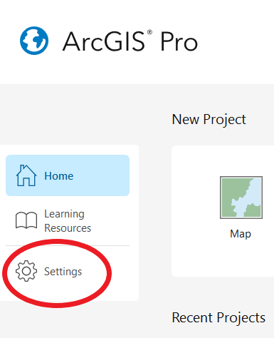
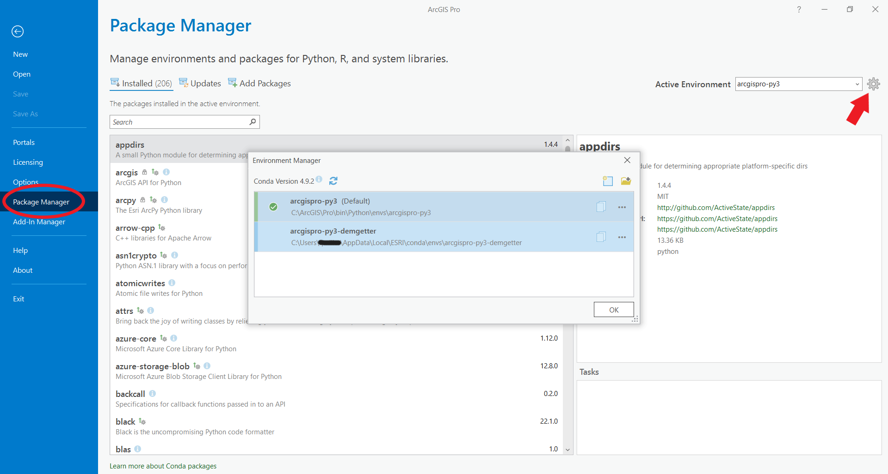
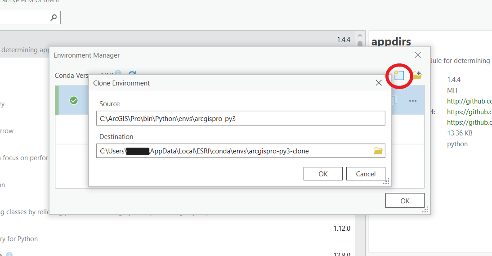
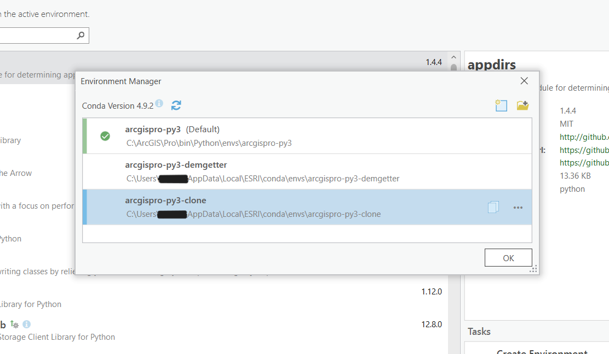
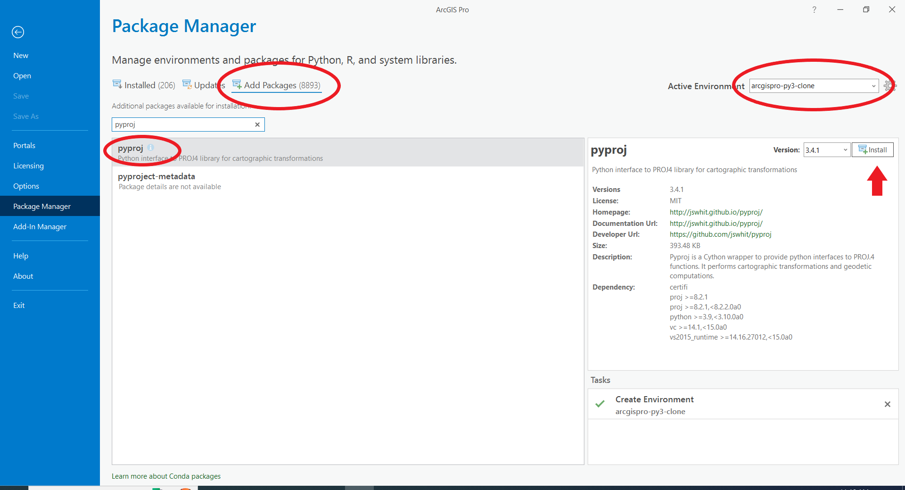
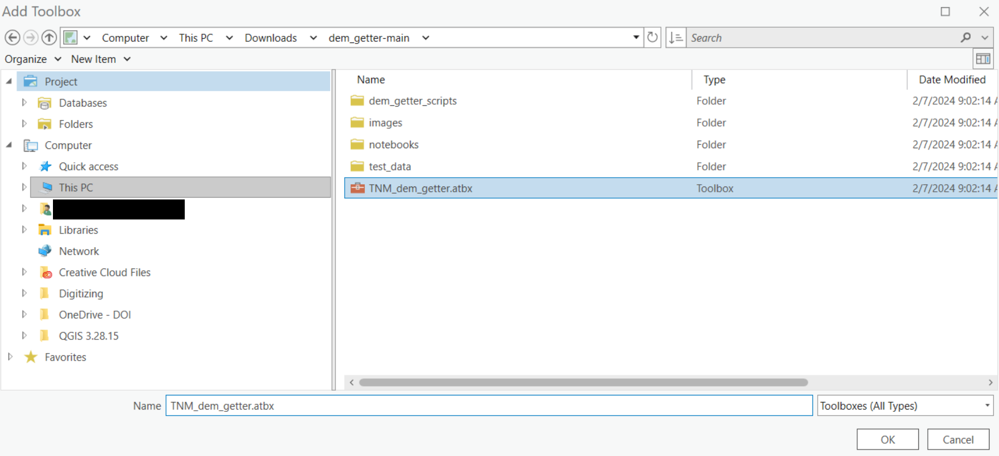
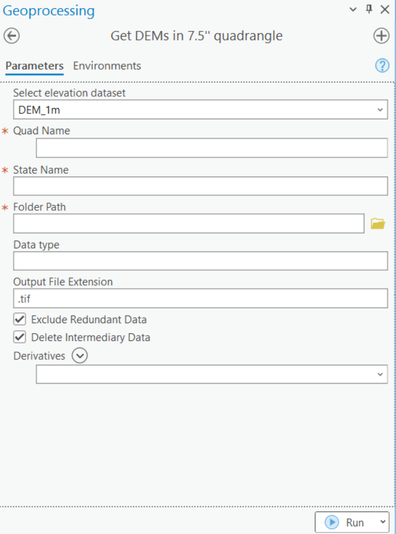
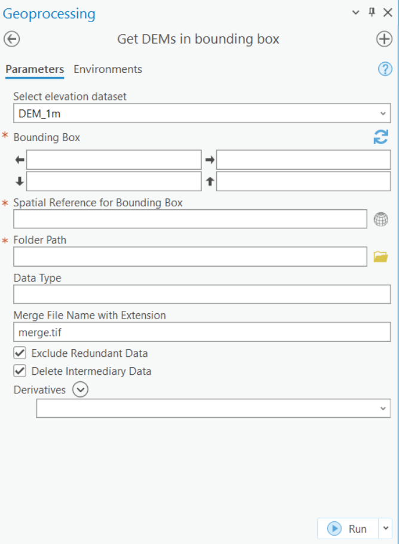

## Purpose of this tool

This repository contains an ArcGIS toolbox of Python 3 tools that allow users to access DEMs from The National Map (TNM) and calculate derivatives directly from within ArcPro. Current tools allow users to:

* Download DEMs from within an area of interest (defined by either the name of a 24k quadrangle map or a bounding box)
* Calculate the following raster derivatives (more updates on the way):
    * **Hillshade** - Calculated by GDAL, a representation of the shading of the landscape with light from a specified direction.
    * **Nadir Hillshade** - A hillshade with vertical illumination. Simply a transformation of slope.  
    * **Aspect** - The orientation of the slope, where slope is calculated with a second-ordered centered difference approximation. Aspect is calculated so that 0,360 is North, 90 is East, 180 is South, and 270 is West.
    * **Absolute value** - The absolute value of pixel values.
    * **Slope magnitude** - The magnitude of the gradient, measured with a second-order centered difference approximation.
    * **Surface roughness** - Calculated by GDAL, the largest difference between a central cell and its 8 neighbors.
    * **Topographic Position Index (TPI)** - The difference between the value (e.g., elevation) of a central pixel and an average of values within an annulus centered on that cell.
    * **Mean moving window (circular and square windows)** - The mean value within a square or circular window.
    * **Less windowed mean (circular and square windows)** - The difference between the value (e.g., elevation) of a central pixel and the mean value in a window centered around that pixel.
    * **Gaussian mean moving window** - The weighted mean of values, where weights are assigned based on a gaussian distribution calculated based on radial distance.
    * **Less gaussian mean** - The difference between the value (e.g., elevation) of a central pixel and the gaussian-weighted mean calculated based on surrounding cells
    * **Difference of gaussian means** - The difference between two gaussian mean blurs of the input raster, a band-pass filtering approach useful for highlighting edges and other fine texture in the image.
    * **Laplacian** (sometimes refered to as curvature) - The sum of the second-derivatives in the x and y directions, calculated with a second-ordered centered difference approximation.
    * **Standard deviation moving window** - The standard deviation within a moving window
    * **Ricker wavelet** - The result of convolving a Ricker wavelet with the digital elevation model.

## Installation

For general installation instructions, see the **Installation** section of the [README](https://code.usgs.gov/gecsc/dem_getter/-/tree/main) on the main repository page.

## Configuring ArcGIS Pro 

1) Certain dependencies are required to use these tools in ArcGIS Pro. To install these packages, begin by opening Arc and clicking on "Settings."

2) Next, select "Package Manager" and then click on the settings wheel next to the "Active Environment" box.

3) Select the default environment, then click the "Clone Environment" icon in the top right corner. Name the clone and press "OK." The environment will take a few minutes to clone.

4) Once the clone has finished, right-click and 'activate' the newly created environment. You should see a green check appear next to it. Then press "OK."

5) Ensure that the clone is now listed as the active environment (if not, open the environments dialog again, right click your new environment, and select activate), then navigate to the "Add Packages" tab. Search for **pyproj**, then click "Install."  **If you don't see pyproj**, try navigating to the 'updates' tab next to 'add packages' and 'update all' above the list of packages. Once this is complete, search for pyrpoj again.

6) At this point you should be ready to begin after restarting the ArcPro application.

## Accessing the Toolbox

These script tools work by having a graphical user interface (GUI) geoprocessing tool in Arc execute the python code contained in this repository. For that to work, paths need to remain internally consistent, therefore, do not move files within the cloned repository directory.

From the catalog pane in Arc, users can either add a folder connection:

or the toolbox directly: 

## Running the Tools

Once the toolbox is available, simply double click on a tool to run it. The toolbox consists of three tools, two provide different ways to obtain DEMs and the third allows for the calculation of derivatives from existing DEMs. Further information on the parameters of each tool is available in the information pop-up adjacent to those parameters.

### Get DEMs in 7.5" quadrangle

This tool will download all the DEMs necessary in order to create a mosaiced DEM that extends over a 7.5" quadrangle boundary.  Given multiple named quadrangles, DEMs will be generated for each.  The tool will optionally produce a selected set of derivatives for visualization.  In the image below red starred parameters are required, others are optional.

### Get DEMs in bounding box

This tool will download all the DEMs necessary in order to create a mosaiced DEM that extends over the specified bounding box. The DEM is created to match the bounding box in the coordinate system specified, thus coordinates of the bounding box must match those used by the specified coordinate system. If no merge file name and extension are specified the tool will not merge and crop downloaded DEMs to the bounding box, instead just downloading them. In the image below red starred parameters are required, others are optional.

### Generate derivative from saved DEM

This tool will generate a derivative (or set of derivatives) based on an input DEM dataset

