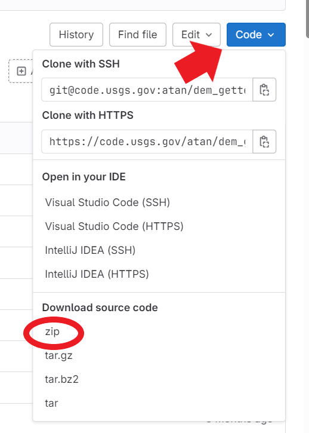
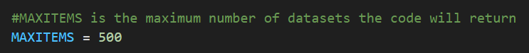

# dem_getter

[](https://apps.nationalmap.gov/lidar-explorer/#/) [](https://apps.nationalmap.gov/downloader/) [](https://apps.nationalmap.gov/tnmaccess/#/) [](https://ngmdb.usgs.gov/topoview/viewer/#4/39.98/-100.06)

## Description

This repository houses a set of Python tools to expedite the acquisition of 3DEP DEM data. These tools were designed to help geologists in the National Cooperative Geologic Mapping Program more efficiently produce high-resolution base maps and tailored derivative products that help identify and characterize geologic features. These derivatives include hillshades and slope maps, as well as more complex derivatives. 

The tools in this repository take advantage of The National Map API (https://apps.nationalmap.gov/tnmaccess/#/) by encapsulating requests into a series of streamlined python functions and wrapping those functions into an ESRI ArcPro Toolbox for use directly within that software. 

In addition to the ArcPro Toolbox the [notebooks](https://code.usgs.gov/gecsc/dem_getter/-/tree/main/notebooks) folder of this repository contains several Jupyter notebooks that demonstrate how to use these tools in Python.

For configuration of the ArcPro Toolbox, see the [Getting Started In Arc Pro](GettingStartedInArcPro.md) read me.

Please reference this tool as:

Miller, Q.M., Johnstone, S.A., dem_getter Python tool for acquiring digital elevation models and derivatives from The National Map. U.S. Geological Survey software release. https://doi.org/10.5066/P13ZTT2N

## Currently Available Tools

[](notebooks)


There are two main entry points for accessing these tools: a Python module and an ArcGIS Pro Toolbox. This read me describes the general toolset and emphasizes the Python module. For a detailed description of the ArcPro toolbox, see the [Getting Started In Arc Pro](GettingStartedInArcPro.md) read me.

All code is housed in the `dem_getter` and `arc_toolbox_scripts` folders, which contains seven python files. The `dem_getter` folder is the main module, and the two files that begin with `dem_` are the main entry points within python to the tools developed here. From a directory containing the `dem_getter` folder, or with such a directory added to the python system path, this would be done by calling:

```
from dem_getter import dem_getter
from dem_getter import dem_derivatives
```

Four of the remaining files have the prefix `arc`, these live in the `arc_toolbox_scripts` folder and are designed to be executed by the [ArcPro Toolbox](GettingStartedInArcPro.md). 

The `derivative_defaults.py` file in the `dem_getter` folder houses default parameters for derivative calculations that a user may want to adjust to their specifications, but fine tuning of derivatives can be done with direct function calls.

These tools accomplish two primary functions:
1. Downloading and Merging Elevation Data
2. Calculating Elevation Derivatives

### 1. Download and Merge Elevation Data from TNM

Retrieves a specified dataset type with the option to limit results by data format. Available datasets and formats are:
* 1 meter DEM - GeoTIFF, IMG
* 5 meter DEM (Alaska only) – Varies
* NED 1/9 arc-second (~3 m) – IMG
* NED 1/3 arc-second (~10 m) – GeoTIFF
* NED 1 arc-second (~30 m) – GeoTIFF
* NED 2 arc-second (Alaska – ~60 m) – GeoTIFF
* Lidar Point Cloud (LPC) – LAS, LAZ   
* Original Product Resolution (OPR) – Varies   

 Users may establish an Area of Interest (AOI) through any of the following:
* Bounding box
* Polygon
* Geopandas Geodataframe
* 24k Quad name

### 2. Calculate Raster Derivatives

This tool is not intended to replace existing options for producing topographic derivatives, instead it seeks to focus on making some common derivatives that primarily rely on kernel-based calculations readily accessible. The approaches used here and the default values specified are designed to produce helpful visualization when characterizing a landscape (e.g., for geologic mapping), not necessarily for making authoritative quantitative measurements of topographic characteristics (e.g., see note on coordinate systems below):

* **Hillshade** - Calculated by GDAL, a representation of the shading of the landscape with light from a specified direction. 
* **Nadir Hillshade** - A hillshade with vertical illumination. Simply a transformation of slope.  
* **Aspect** - The orientation of the slope, where slope is calculated with a second-ordered centered difference approximation. Aspect is calculated so that 0,360 is North, 90 is East, 180 is South, and 270 is West.
* **Absolute value** - The absolute value of pixel values.
* **Slope magnitude** - The magnitude of the gradient, measured with a second-order centered difference approximation.
* **Surface roughness** - Calculated by GDAL, the largest difference between a central cell and its 8 neighbors.
* **Topographic Position Index (TPI)** - The difference between the value (e.g., elevation) of a central pixel and an average of values within an annulus centered on that cell.
* **Mean moving window (circular and square windows)** - The mean value within a square or circular window.
* **Less windowed mean (circular and square windows)** - The difference between the value (e.g., elevation) of a central pixel and the mean value in a window centered around that pixel.
* **Gaussian mean moving window** - The weighted mean of values, where weights are assigned based on a gaussian distribution calculated based on radial distance.
* **Less gaussian mean** - The difference between the value (e.g., elevation) of a central pixel and the gaussian-weighted mean calculated based on surrounding cells. This is a high-pass filtering approach useful for highlighting fine texture.
* **Difference of gaussian means** - The difference between two gaussian mean blurs of the input raster, a band-pass filtering approach useful for highlighting edges and other fine texture in the image.
* **Laplacian** (sometimes refered to as curvature) - The sum of the second-derivatives in the x and y directions, calculated with a second-ordered centered difference approximation.
* **Standard deviation moving window** - The standard deviation within a moving window.
* **Ricker wavelet** - Computes a 2D continuous wavelet transformation using the Ricker wavelet. This wavelet functions as a band-pass filter. It enhances specific topographic features by magnifying variations at a designated spatial frequency, controlled by the parameter sigma.   
   


### IMPORTANT NOTE ON COORDINATE SYSTEMS
 Many topographic derivatives depend on both the elevation differences between cells and the size of raster cells.  If you have chosen a coordinate system that measures location in something other than meters (e.g.,feet or degrees), the elevation measurements will not be in the same units as the distance between pixel measurements. This will result in inaccurate derivatives. This code will supply a best-guess [z-factor](https://www.esri.com/arcgis-blog/products/product/imagery/setting-the-z-factor-parameter-correctly/) (the conversion between units of degrees and meters) in instances where geographic coordinate systems based in degrees are used. This best-guess is based on the latitude of the upper-left corner of the DEM, and assumes elevations are stored in meters. While this should suffice for most visualization purposes, best practice is to use a projected coordinate system (e.g., UTM) when producing derivatives, particularly in situations where the absolute magnitude of values are of interest because something is being measured from the derivative (rather than just the relative change in values being visualized). 

## Installation 

[](GettingStartedInArcPro.md) 

Users have two options for installing this toolbox: either download a zip file of this repository with every new release, or clone the repository using git and pull the latest changes as necessary.

### Download

Download the source code as a zipped file by clicking on the "Code" button and selecting that option.



Unzip the file to a folder of your choosing. This will extract a single folder named `dem-getter-main` .

### Clone

This method requires you to have git installed on your computer. If you know you do, you can skip down two steps and use that instance of it. If not, you can use the instance that was installed in the default conda environment when ArcGIS Pro was installed (if you are installing for ArcPro).

* Click on 'Start' in the lower-left of your desktop.
* From the list of programs, select ArcGIS and then Python Command Prompt.
* At the prompt, type cd and the path of the location where you would like the toolbox to be.
* Paste in git clone https://code.usgs.gov/gecsc/dem_getter.git
* cd to dem-getter-main

Now, whenever you get notice of a new release or if it's just been a while and you want to make sure you are using the most up-to-date version, go back to this folder and run `git pull`.

## Common Issues

### Hitting the Download Limit

The maximum number of products returned is 500. If you'd like to fetch more produts than that, the global variable `MAX_ITEMS` can be altered in the [dem_getter.py](https://code.usgs.gov/gecsc/dem_getter/-/blob/main/dem_getter/dem_getter.py) file:



### No Products Returned

If no products are returned where you think they should be, try not specifying data type.

If you are working in ArcPro, we have also supplied a `3DEPElevationIndex.lyr` file that shows the spatial availability of different layers. This is provided by the [3DEPElevationIndex rest services](https://index.nationalmap.gov/arcgis/rest/services/3DEPElevationIndex/MapServer/).

## Requirements

If you are building a virtual environment to execute this code, the following are dependencies:

* numpy
* gdal
* pyproj
* scipy
* matplotlib

The jupyter notebooks additionally rely on:   

* jupyter
* geopandas

We have also supplied a .yml file. To use this with conda to create an environment, run the following command from the anaconda prompt

```
    conda env create -f dem_getter.yml
```

## Requesting additional features

Please get in touch with Sam Johnstone (sjohnstone@usgs.gov) or submit an issue if you would like to request anything.

## Authors and acknowledgment

This code was primarily authored by Quinn Miller with some guidance from Sam Johnstone.  This tool was made possible by the APIs supplied by The National Map. Funding for this work was supplied by the National Cooperative Geologic Mapping Program.

## Project status

This work is part of the Advancing Topographic Analysis for NCGMP project. This project is slated to remain active through September 2024.

If a new version of this software is available, you can find it at https://code.usgs.gov/gecsc/dem_getter/-/releases to view all releases.

This code was routed as IPDS entry IP-157697.

Disclaimer
=======
[](DISCLAIMER.md) 

License
=======
[](LICENSE.md) 
